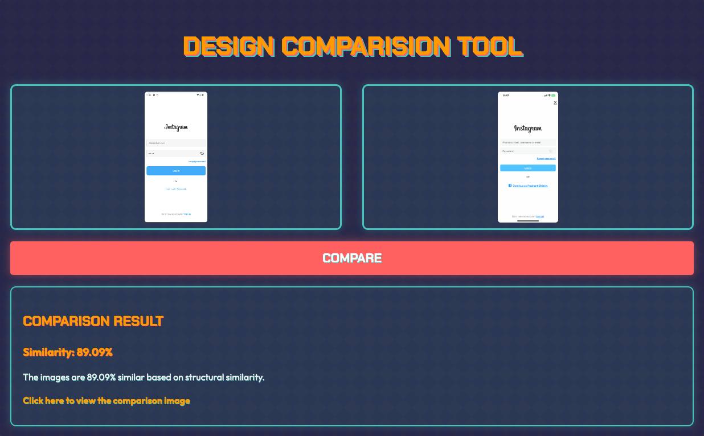
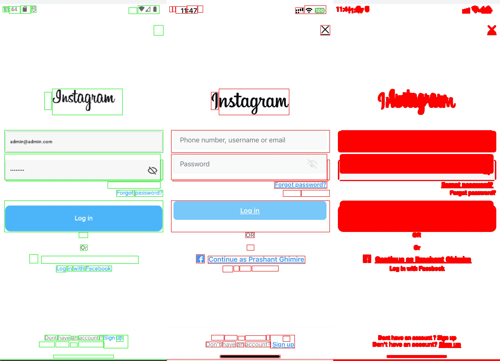

# Design Comparison Tool

Compares a Figma design screenshot with a screenshot of the built screen, focusing on UI components such as text colors, buttons, and other similar elements. The tool is built using Flask and Python, with a neumorphic design for the user interface.

Screenshots:

## Features

- Upload two images: Figma design screenshot and built screen screenshot
- Compare design specifications (colors, UI components)
- Generate useful comparison results
- Neumorphic web interface

## How it works

1. User uploads two images through the web interface
2. User clicks the "Compare" button to start the analysis
3. The application processes the images and compares the design elements
4. Results are displayed on the web page

## Image Comparison Technical Details

The image comparison process uses several computer vision techniques to analyze and compare the uploaded images:

1. **Image Preprocessing**:

   - Both images are read using OpenCV (cv2.imread)
   - The Figma design image is resized to match the dimensions of the built screen image (cv2.resize)
   - Both images are converted to grayscale (cv2.cvtColor with cv2.COLOR_BGR2GRAY)

2. **Structural Similarity Index (SSIM)**:

   - The scikit-image library's structural_similarity function is used to compute the SSIM between the two grayscale images
   - SSIM measures the similarity between two images based on luminance, contrast, and structure
   - The function returns a similarity score and a difference image

3. **Difference Analysis**:

   - The difference image is normalized and converted to 8-bit unsigned integer format
   - A binary threshold is applied to the difference image using Otsu's method (cv2.threshold with cv2.THRESH_BINARY_INV | cv2.THRESH_OTSU)
   - Contours are found in the thresholded image (cv2.findContours)

4. **Visualization of Differences**:

   - Significant differences (contours with area > 40 pixels) are highlighted on both images:
     - Green rectangles on the Figma design image
     - Red rectangles on the built screen image
   - A filled version of the Figma image is created with differences filled in red

5. **Result Generation**:
   - A comparison image is created by horizontally stacking the annotated Figma image, annotated built image, and filled difference image
   - The similarity score is converted to a percentage
   - A unique filename is generated for the comparison image using the current date and time

This process allows for a detailed visual and quantitative comparison of the two designs, highlighting areas of difference and providing an overall similarity score.
